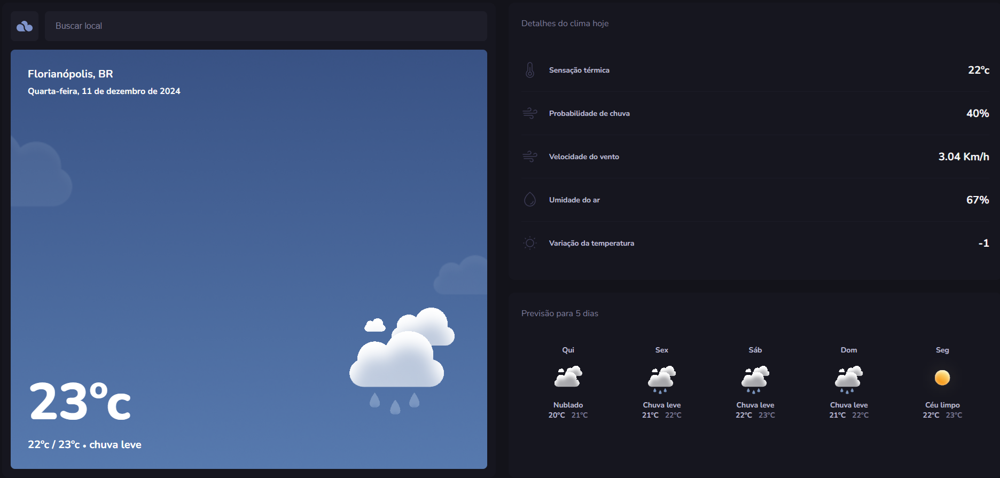

<h1 align="center">TypeWeather</h1>

TypeWeather - TypeScript

  <a href="#-tecnologias">Tecnologias</a>&nbsp;&nbsp;&nbsp;|&nbsp;&nbsp;&nbsp;
  <a href="#-projeto">Projeto</a>&nbsp;&nbsp;&nbsp;
  

 

  

## 🚀 Tecnologias

Esse projeto foi desenvolvido com as seguintes tecnologias:

- HTML e CSS
- TypeScript
- Figma
- React

## 💻 Projeto

- No projeto descrito, foi realizado um estudo de TypeScript e React.

---

Feito com ♥ by Vinicius Zamprogno, estudante na Rocketseat 👋
